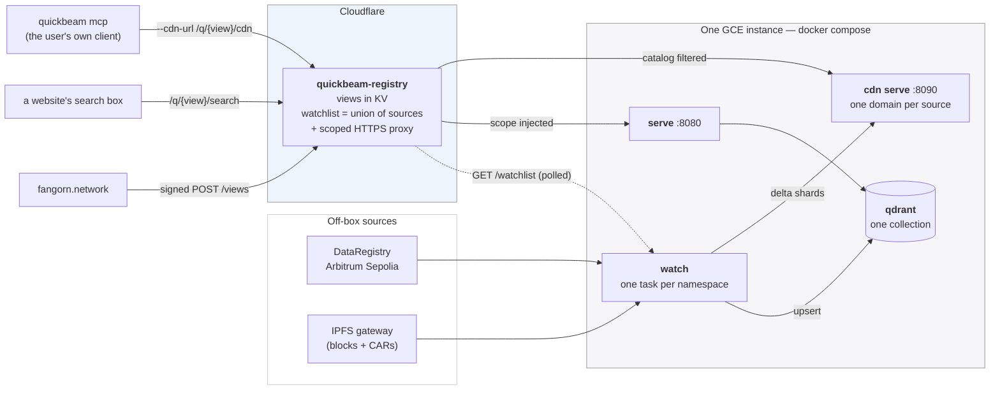
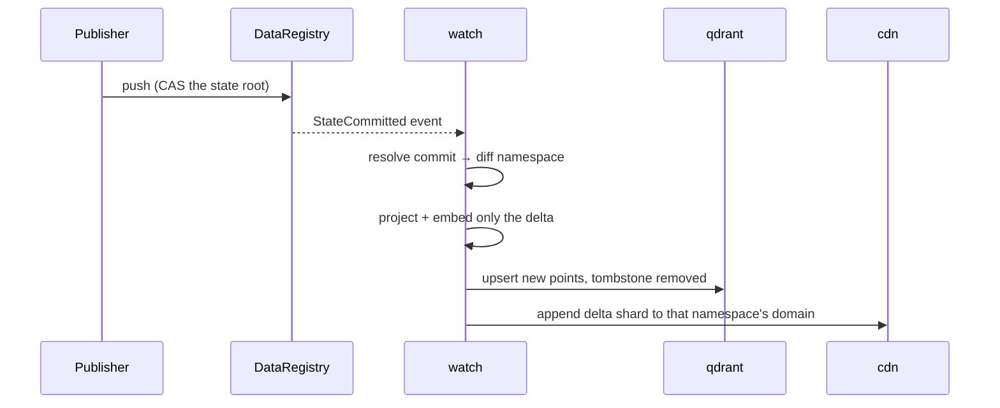

# Deploying Quickbeam

**One shared instance serves everyone, and each namespace is embedded exactly once.**
You stand it up once. After that, a user creates a *view* from the Fangorn website —
no SSH, no compose edit, no new container.

A **view** is a named set of namespaces belonging to one requester. It gets its own
search URL and its own MCP catalog, but it is a *filter* over the shared collection,
never a copy of the vectors. Two people asking for the same namespace get the same
points, and the second one costs no indexing work at all.

---

## Topology



**Embed once, view many.** The watchlist is the deduplicated union of every view's
sources, so a namespace is watched while at least one view references it and drops off
when the last one goes — no refcount needed.

**Nothing MCP-shaped is provisioned per requester.** `quickbeam mcp` is a local
pull-client whose entire universe is whatever `/catalog` its `--cdn-url` returns, so
the worker filtering that catalog to a view's domains *is* the per-user MCP. The user
runs the client themselves.

**The worker proxies queries** because the instance speaks plain HTTP and a browser on
HTTPS cannot call it (mixed content). Proxying supplies TLS with no per-namespace DNS
record or certificate, and it injects the view's `scope` so a view URL always means
that view's namespaces.

**Naming rule, shared by two codebases:** a source's CDN domain is
`{owner[2:10]}-{namespace}` — `_domain_for()` in `quickbeam/watcher.py` names the
directory, `domainFor()` in the worker names it back to filter a catalog. Namespace
alone is not enough: two publishers both calling a namespace `music` would intermix
their shards in one domain.

### What happens when a commit lands



`quickbeam watch` is **push-based**. `--poll-interval` is the reconnect backoff for a
dropped stream, *not* a polling timer. `--sources-refresh` is the separate interval at
which it re-reads the watch list.

---

## 1. Run it locally

Prove the image before any cloud is involved. Local runs don't need the worker — point
`SOURCES_URL` at a file.

```sh
cd quickbeam
cp .env.example .env      # set ETH_PRIVATE_KEY, PINATA_GATEWAY, QDRANT_API_KEY
docker compose up -d --build
```

For a static list, write `sources.json` into the shared volume and set
`SOURCES_URL=file:///data/sources.json`:

```json
[ "0x147c24c5Ea2f1EE1ac42AD16820De23bBba45Ef6:robinhood" ]
```

The list also accepts `[{"owner":"0x…","namespace":"…"}]` and either form wrapped in
`{"sources": …}` — which is the shape the worker's `/watchlist` returns.

Check it:

```sh
docker compose logs -f watch
#   [Watcher] + 0x…:robinhood — now watching 1 source(s)
#   [Watcher] 0x…:robinhood: subscribed (pid …)
#   [Watcher] 0x…:robinhood: seeded — N new record(s) embedded

curl 'localhost:8080/search?q=<term>&scope=0x147c24c5…:robinhood'
curl localhost:8090/domains/147c24c5-robinhood/manifest   # {owner8}-{namespace}
```

**Add a second entry to the file and watch a second task start with no restart.** That
is the whole point of the design — if it needs a restart, something regressed.

A non-zero `N` in the seed line is the real proof: the Node CLI, the chain read, the
IPFS fetch, the projection and the embed all worked.

> **`seeded — no new records` / `head: null`?** That namespace has nothing settled
> on-chain. Confirm with
> `docker compose exec watch fangorn read <ns> --owner <owner>` — if it returns
> `"head":null` with empty arrays, nothing was ever pushed there. Not a deployment
> fault.

### Configuration

| Variable | Notes |
|---|---|
| `SOURCES_URL` | The registry worker's `/watchlist` — the deduplicated union of every view's sources. Namespaces arrive there, never here. |
| `SOURCES_REFRESH` | Seconds between watch-list polls. |
| `ETH_PRIVATE_KEY` | **Required even though the container only reads** — the `fangorn` CLI refuses to start without one. A throwaway is correct: never spent, no funding, no registration. |
| `PINATA_GATEWAY` | Reads resolve every block by CID through this. The default is `ipfs.io`, DNS-filtered on many networks. |
| `QDRANT_API_KEY` | Any random string; Qdrant enforces it on every request. |
| `COLLECTION` | One collection for all namespaces. |
| `INTERVAL` | Reconnect backoff. Not a monitoring interval. |

Do **not** bake a `~/.fangorn/config.json` into the image. The CLI returns early when
that file exists and ignores every environment variable above.

---

## 2. The instance

```sh
gcloud compute instances create quickbeam-1 \
  --machine-type=e2-small \
  --boot-disk-size=20GB --boot-disk-type=pd-balanced \
  --zone=us-central1-a \
  --image-family=debian-12 --image-project=debian-cloud

# on the box
sudo apt-get update && sudo apt-get install -y docker.io docker-compose-v2 git
git clone <this repo> && cd fangorn/quickbeam
cp .env.example .env      # SOURCES_URL → the deployed worker
docker compose up -d --build
```

Open `8080` and `8090` to the worker, then set `SEARCH_URL` and `CDN_URL` in
`webworker/quickbeam-registry/wrangler.toml` to this instance and deploy the worker.
There is no `MCP_URL`: a user's MCP is their own `quickbeam mcp` client pointed at
`/q/{viewId}/cdn`.

**Machine type.** Start on `e2-small` (2GB). If a seed OOMs, stop the instance, change
the type to `e2-medium` (4GB) and start it again — the disk survives, so it costs a
minute. `e2-micro` (1GB, free tier) is too small: the ONNX model plus one Node
subscribe process per source will not fit.

**Do big backfills elsewhere.** E2 shared-core types are burstable (`e2-small`
baselines at 0.5 vCPU) and a full seed embed is a sustained burn that exhausts burst
credits. Build the collection on a GPU box and restore a snapshot here (see the
Snapshots section in `README.md`); the instance then only handles deltas.

**What scales per namespace** is one `fangorn subscribe` Node process, not the model.
Measure its RSS before promising a namespace count.

---

## 3. Adding and removing views

**Adding** is a user action: sign in at fangorn.network with an active storage
subscription, name a view and give it a publisher + namespace, and press Create. The
worker stores the view and its sources join the watchlist; this instance picks up any
*new* namespace within `SOURCES_REFRESH` and logs `[Watcher] + owner:namespace`.

A namespace another view already covers logs nothing at all — it is already embedded,
and the new view queries the same points. That silence is the design working.

**Removing** is a founder action — `POST /admin/remove` with the view id, signed by a
wallet in `ADMIN_WALLETS`. See `webworker/quickbeam-registry/README.md`. A source stops
being watched only when the **last** view referencing it goes; nothing expires on its
own, so a lapsed subscription keeps running until someone removes it.

Neither touches this box.

---

## Gotchas

- **The compose `mcp` service serves the whole corpus,** not a view — it is bound to
  one `--cdn-url` at startup. Per-view MCP is the user's own client pointed at
  `/q/{viewId}/cdn`. Its endpoint is `/mcp`, not `/`: a healthy server returns 404 on
  `/` and 400 on `/mcp` for a request without a handshake.
- **The CDN domain rule is duplicated in two languages.** `_domain_for()` in
  `watcher.py` and `domainFor()` in the registry worker must agree, or a view's catalog
  comes back empty. If you change one, change the other.
- **`cdn` restart-loops for a few seconds on first boot** — `cdn serve` exits if its
  directory does not exist yet, and the watcher creates it when it bakes the first
  domain. The restart policy covers the window.
- **A registry blip does not tear down the fleet.** If the watch-list fetch fails, the
  watcher keeps every running source rather than reading the failure as
  "everyone unsubscribed".
- **`Api key is used with an insecure connection`** is expected inside the compose
  network. It matters only if you expose Qdrant publicly.
- **The subscribe cursor lives at `/data/.fangorn/`** — that is why the working
  directory is the mounted volume; an ephemeral one replays from scratch on restart.
- **The embedding model is baked into the image.** Changing `--embedding-model` means
  rebuilding, or it downloads at every container start.
- **CPU-only hosts work** because `_build_text_embedding()` asks onnxruntime which
  providers exist before requesting CUDA. A GPU box still selects CUDA automatically.
- **`/browse` is not namespace-scoped.** It returns the whole collection. The search
  routes are the scoped ones.

## Teardown

```sh
docker compose down -v     # -v also drops the Qdrant data and every CDN shard
```
