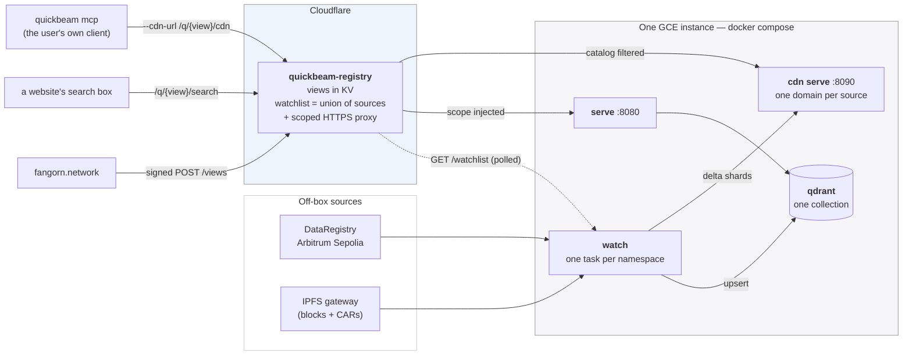
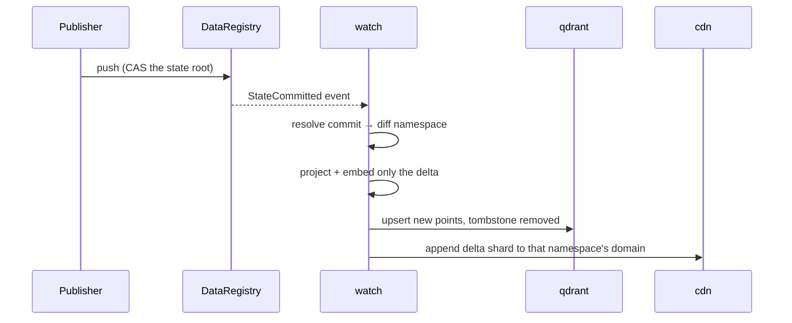

# Deploying Quickbeam

**One shared instance serves everyone, and each namespace is embedded exactly once.**
The container only needs to be set up once. After that a user creates a *view* from the Fangorn website.

A **view** is a named set of namespaces belonging to one requester. It gets its own search URL and its own MCP catalog (based on a flag on the Fangorn website), but it is a *filter* over the shared collection and not a copy of the vectors. Two people asking for the same namespace get the same points, but the second one costs no indexing work at all.

---

## Topology



**Embed once, view many.** The watchlist is the deduplicated union of every view's sources, so a namespace is watched while at least one view references it and drops off when the last one goes.

**The per-view MCP is a filtered catalog.** `quickbeam mcp` is a pull-client whose entire universe is whatever `/catalog` its `--cdn-url` returns, so the worker filtering that catalog to a view's domains is what scopes it. By default the user runs the client themselves. Ticking "host an MCP for me" makes the worker create one **Cloud Run** service per view instead.

**The Cloudflare worker proxies queries** because, currently, the instance uses plain HTTP and a browser on HTTPS cannot call it (mixed content). Proxying supplies TLS with no per-namespace DNS record or certificate, and it injects the view's `scope` so a view URL always means that view's namespaces.

**A source is the whole `app:publisher:subspace` triple.** The app is the first identifier and it is what every chain read resolves against, so each watched source carries its own. One instance can serve views across several apps. `APP` is only the fallback for a watchlist entry that names none. An entry with no app and no fallback is dropped.

**Naming rule:** a source's CDN domain is `{app}-{owner[2:10]}-{namespace}`, where a 0x app *id* is sliced to its first 8 hex chars and a plain app *name* is slugged whole. All three identifiers are needed: two publishers both calling a namespace `music` would intermix their shards in one domain, and so would one publisher holding `music` in two apps.

### What happens when a commit lands



`quickbeam watch` is **push-based**. `--poll-interval` is the reconnect backoff for a dropped stream, *not* a polling timer. `--sources-refresh` is the separate interval at which it re-reads the watch list.

---

## 1. Run it locally

Local runs don't need the worker. Instead, you can point `SOURCES_URL` at a `json` file.

```sh
cp .env.example .env      # set ETH_PRIVATE_KEY, PINATA_GATEWAY, QDRANT_API_KEY, APP
docker compose up -d --build
```

`--build` is not optional the first time, and not optional after a source change either. The Dockerfile `COPY`s `quickbeam/` at build time, so a plain `docker compose up -d` reuses the old layer.

For a static list, write `sources.json` into the shared volume and set `SOURCES_URL=file:///data/sources.json`. An example `sources.json`:

```json
[ {"app": "fangorn", "owner": "0x147c24c5Ea2f1EE1ac42AD16820De23bBba45Ef6",
   "namespace": "robinhood"} ]
```

The list also accepts `"APP:OWNER:NAMESPACE"` strings, the older `"OWNER:NAMESPACE"` form (which takes the `APP` env var as its app), and either form wrapped in `{"sources": …}` (the shape the worker's `/watchlist` returns). `*` on owner or namespace widens the subscription to the app level.

To check your container run:

```sh
docker compose logs -f watch
#   [Watcher] + 0x7e14…:0x147c…:robinhood — now watching 1 source(s)
#   [Watcher] 0x147c…:robinhood: subscribed (pid …)
#   [Watcher] 0x147c…:robinhood: seeded — N new record(s) embedded

curl 'localhost:8080/search?q=<term>&scope=fangorn:0x147c24c5…:robinhood'
curl localhost:8090/domains/7e1497af-147c24c5-robinhood/manifest
```

A non-zero `N` in the seed line indicates the Node CLI, the chain read, the IPFS fetch, the projection and the embed all worked.

You can also add a second entry to the file and watch a second task start with no restart required!

> **`seeded — no new records` / `head: null`?** That namespace has nothing settled
> on-chain. Confirm with `docker compose exec watch fangorn read <ns> --owner <owner>`.
> if it returns `"head":null` with empty arrays, nothing was ever pushed there.

### Configuration

You can see the fully annotated list in [`.env.example`](.env.example), but here are the most imporant ones:

| Variable | Notes |
|---|---|
| `IMAGE` | The Docker tag (Artifact Registry) every service runs. Unset = build locally. Must be set to a pushed tag on the box. |
| `SOURCES_URL` | The worker's `/watchlist`, or a `file://` path. |
| `APP` | Fallback app for an entry naming none. When deployed, it should be the same as the worker's `DEFAULT_APP` (`fangorn`). |
| `ETH_PRIVATE_KEY` | **Required even though the container only reads** — the `fangorn` CLI refuses to start without one. Provide a throwaway since no onchain operations are performed. |
| `PINATA_GATEWAY` | Reads resolve every block by CID through this. We recommend you set this since the `ipfs.io` may not serve this content (ISP specific). |
| `FROM_BLOCK` | History replay before going live and is the **only** way a wildcard (`*:*`) source discovers namespaces published before the box existed. It costs one `eth_getLogs` per 1000 blocks. |
| `QDRANT_API_KEY` | Any random string. Qdrant enforces it on every request. |

> Warning: Do **not** bake a `~/.fangorn/config.json` into the image. The CLI returns early when that file exists and ignores every environment variable above.

---

## 2. One-time cloud setup

### Authorize
`gcloud auth login`

### Artifact Registry

```sh
PROJECT=$(gcloud config get-value project)
REGION=us-east4
gcloud artifacts repositories create quickbeam --repository-format=docker --location=$REGION
gcloud auth configure-docker $REGION-docker.pkg.dev

# then in .env:
#   IMAGE=us-east4-docker.pkg.dev/<project>/quickbeam/quickbeam:latest
```

**For small compute instances and large datasets, it is recommended to build locally, not on the box.** E2 shared-core types are burstable and small. Installing the ONNX stack on one is slow at best and OOMs at worst, and it burns the same burst credits the watcher needs to seed. The image is ~2.8GB and takes several minutes: it carries the CPU ONNX stack, Node plus the pinned `@fangorn-network/sdk`, and the embedding model baked in (left to run time it re-downloads on every container start).

### The instance

```sh
gcloud compute instances create quickbeam-1 \
  --machine-type=e2-medium \
  --boot-disk-size=20GB --boot-disk-type=pd-balanced \
  --zone=$REGION-a \
  --image-family=debian-12 --image-project=debian-cloud \
  --tags=quickbeam --scopes=cloud-platform

gcloud compute ssh quickbeam-1 --zone=$REGION-a --command='
  sudo apt-get update && sudo apt-get install -y docker.io docker-compose-v2 &&
  sudo usermod -aG docker $USER && sudo systemctl enable docker &&
  gcloud auth configure-docker '$REGION'-docker.pkg.dev --quiet'
```

`--scopes=cloud-platform` is what lets the VM's default service account pull from Artifact Registry. without it the pull 403s. `systemctl enable docker` is all that's needed to survive a reboot. Every service is `restart: unless-stopped`, so no unit file and no cron.

**Machine type.** `e2-medium` (4GB) is the working default. `e2-small` (2GB) runs with little headroom.

**Do big backfills elsewhere.** A full seed embed is a sustained burn that exhausts burst credits. Build the collection on a GPU box, migrate or import it, and let the instance handle deltas only.

### Firewall

```sh
gcloud compute firewall-rules create quickbeam-http \
  --allow=tcp:8080,tcp:8090 --target-tags=quickbeam \
  --description="registry worker → search + cdn"
```

### Point the worker at the box

```sh
gcloud compute instances describe quickbeam-1 --zone=$REGION-a \
  --format='get(networkInterfaces[0].accessConfigs[0].natIP)'
```

Set `SEARCH_URL` and `CDN_URL` in `webworker/quickbeam-registry/wrangler.toml` to `http://<IP>:8080` / `:8090`, or to a grey-cloud A record pointing at that IP, which is what the live deploy uses (`http://qb.sond3r.com:8080`) so the IP can change without a worker deploy. Then `wrangler deploy`.

There is no `MCP_URL`: a user's MCP is their own `quickbeam mcp` client pointed at `/q/{viewId}/cdn`.

---

## 3. Deploying

Both scripts run from the repo root and wrap the build → push → pull cycle. The box only gets `docker-compose.yml` and `.env`.

```sh
./deploy.sh                  # build, push, tell the box to pull
./deploy.sh --env            # also copy .env — first deploy, or after rotating a key
./deploy.sh --dry-run        # print every command, run none
./deploy.sh --fresh          # wipe all state and re-embed from chain (prompts)
./deploy-sources.sh [file]   # deploy with a STATIC watch list (default: data/sources.json)
```

`INSTANCE` and `ZONE` are environment overrides (default `quickbeam-1` / `us-east4-a`).

What `deploy.sh` does:

- **Refuses to deploy with `IMAGE` unset or local.** Compose would fall back to `quickbeam:local`, which doesn't exist on the box, and then tries to build from a directory with no Dockerfile.
- **Rewrites `SOURCES_URL` on the box every run.** That variable is the box's mode, and a box left on a `file://` list ignores the worker. `deploy-sources.sh` calls back into `deploy.sh` with `WATCHLIST_URL` set to claim the other direction, so a box converges either way in one run.
- **Tags the git sha alongside `:latest`** (`-dirty` if `quickbeam/`, `pyproject.toml` or the `Dockerfile` has uncommitted or untracked changes, so the tag never lies). Roll back by pulling an older sha tag, `docker compose pull`, on a moving `:latest` cannot tell you what a box is running.
- **Prunes dangling images** after the pull. Every pull of a moving `:latest` leaves the previous ~2.8GB image untagged and invisible to plain `docker images`.
- **`--fresh` aborts unless the box's `FROM_BLOCK` is set.** A wildcard watch list gets no startup seed read, so history replay is the only way anything is discovered. Wiping without it leaves an empty collection forever.

`--fresh` drops **three** stores together via `docker compose down -v`: the qdrant volume (the vectors), `/data/db/checkpoint.json` (whose processed ids make the watcher skip what it already embedded) and `/data/cdn` (whose manifests make the append skip what it already delivered).

`deploy-sources.sh` validates the JSON before shipping it. `_fetch_sources` skips an entry it cannot parse and *drops* one that names no app, so a typo otherwise comes back as a box that watches nothing. The file goes into the shared volume with `docker compose cp` (`/data` in the container *is* the volume, so a copy in the home directory is invisible to `watch`), and no restart is needed since `watch` re-reads it every `SOURCES_REFRESH` seconds.

---

## 4. Adding and removing views

**Adding** is a user action. Users sign in at fangorn.network with an active storage subscription to create views. The worker stores the view and its sources join the watchlist. The instance picks up any *new* namespace within `SOURCES_REFRESH` and logs `[Watcher] + owner:namespace`.

A namespace another view already covers logs nothing at all since it is already embedded and the new view queries the same points.

**Removing** is `POST /views/remove` with the view id, signed by the wallet that created it (the website's "Stop watching" button), or `POST /admin/remove` for any view, signed by a wallet in `ADMIN_WALLETS`. See `webworker/quickbeam-registry/README.md`. A source stops being watched only when the **last** view referencing it is removed. Nothing expires on its own, so a lapsed subscription keeps running until someone removes it.

---

## Gotchas

- **The `fangorn` SDK version is pinned in the `Dockerfile` and must be bumped when the DataRegistry moves.** The registry address rides inside the SDK's `config.js`, so a cached layer on an old version reads a retired registry and sees none of the state published to the new one.
- **The compose `mcp` service serves the whole data collection.** It is bound to one `--cdn-url` at startup. Its endpoint is `/mcp` not `/`
- **The watch-list fetch sends an explicit `User-Agent`.** Cloudflare's bot check answers urllib's default `Python-urllib/x.y` with a **403 (error 1010)** before the worker ever runs. `/watchlist` is unauthenticated, so a 403 there means the edge blocked you and the watcher then holds a zero-source set forever, which cascades into `cdn` restart-looping because no domain is ever baked.
- **`cdn` restart-loops for a few seconds on first boot** — `cdn serve` exits if its directory doesn't exist yet, and the watcher creates it when it bakes the first domain. The restart policy covers this window.
- **A registry blip does not tear down the fleet.** If the watch-list fetch fails, the watcher keeps every running source rather than reading the failure as "everyone unsubscribed".
- **`Api key is used with an insecure connection`** is expected inside the compose network. It matters only if you expose Qdrant publicly.
- **The subscribe cursor lives at `/data/.fangorn/`** The working directory is the mounted volume since an ephemeral one replays from scratch on restart.
- **`/browse` is not namespace-scoped.** It returns the whole collection. The search routes are the scoped ones.

## Teardown

```sh
docker compose down -v     # -v also drops the Qdrant data and every CDN shard
gcloud compute instances delete quickbeam-1 --zone=$REGION-a
gcloud compute firewall-rules delete quickbeam-http
```
