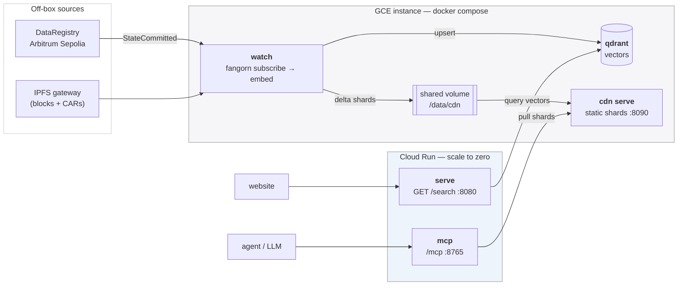
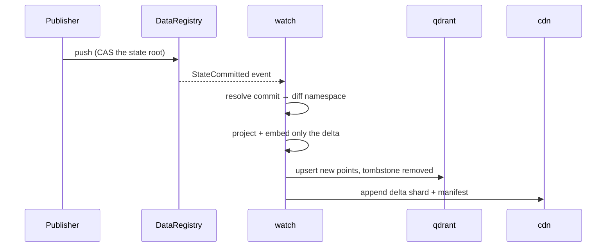

# Deploying a Quickbeam instance

One watched namespace = one deployment. Given a publisher address and a namespace,
this stack follows that publisher's on-chain head, embeds every commit as it lands,
and exposes the result as a search API for websites and an MCP server for agents.

---

## Topology

The pieces are split by **state**, not by function. Three of them need a real disk, a
shared filesystem and uninterrupted CPU; two are stateless request handlers.



**Why `watch` and `cdn serve` are together:** the watcher appends delta shards to the
directory `cdn serve` reads. They are the only pair that needs a shared filesystem.

**Why the watcher is not on Cloud Run:** it never binds a port (so it fails a
service's startup probe), and outside a request Cloud Run throttles CPU to near zero
unless you pay for always-allocated CPU with `min-instances=1`. On a VM it is just a
container with a restart policy.

**Why Qdrant is not on Cloud Run:** no persistent disk, and instances get recycled.

### What happens when a commit lands



`quickbeam watch` is **push-based**. `--poll-interval` is the reconnect backoff for a
dropped stream, *not* a polling timer.

---

## 1. Run it locally first

Prove the image before any cloud is involved.

```sh
cd quickbeam
cp .env.example .env
# edit .env: OWNER, NAMESPACE, ETH_PRIVATE_KEY, PINATA_GATEWAY, QDRANT_API_KEY
docker compose up -d --build
```

The first build takes a few minutes — it installs Node, the `fangorn` CLI, and bakes
the ONNX embedding model into the image (~2.5GB total).

Check it:

```sh
docker compose logs -f watch
#   [Watcher] <owner>:<ns>: subscribed (pid …)
#   [Watcher] <owner>:<ns>: seeded — N new record(s) embedded

curl 'localhost:8080/search?q=<term>'          # the website path
curl localhost:8090/catalog                     # the CDN the MCP pulls from
curl localhost:8090/domains/$NAMESPACE/manifest
```

A non-zero `N` in that seed line is the real proof: it means the Node CLI, the chain
read, the IPFS fetch, the projection and the embed all worked.

> **`seeded — no new records` / `head: null`?** The namespace has nothing settled
> on-chain. Confirm with
> `docker compose exec watch fangorn read $NAMESPACE --owner $OWNER` — if it returns
> `"head":null` with empty arrays, that publisher has not pushed that namespace (or
> the head was reset). Nothing to fix in the deployment; point it at a live namespace.

### Configuration

| Variable | Notes |
|---|---|
| `OWNER` | Publisher address whose head is followed. `fangorn status` prints it. |
| `NAMESPACE` | Namespace key inside that publisher's root map. Also used as the Qdrant collection and CDN domain name. |
| `ETH_PRIVATE_KEY` | **Required even though the container only reads** — the `fangorn` CLI refuses to start without one. A throwaway is correct: never spent, needs no funding, no registration. |
| `PINATA_GATEWAY` | Reads resolve every block by CID through this. The default is `ipfs.io`, which is DNS-filtered on many networks. |
| `QDRANT_API_KEY` | Any random string. Qdrant enforces it on every request. |
| `INTERVAL` | Reconnect backoff in seconds. Not a monitoring interval. |
| `*_PORT` | Host ports, so several namespaces can share one box. |

Do **not** bake a `~/.fangorn/config.json` into the image. The CLI returns early when
that file exists and ignores every environment variable above.

---

## 2. The GCE instance

Runs `qdrant`, `watch` and `cdn serve`.

```sh
gcloud compute instances create quickbeam-1 \
  --machine-type=e2-small \
  --boot-disk-size=20GB --boot-disk-type=pd-balanced \
  --zone=us-central1-a \
  --image-family=debian-12 --image-project=debian-cloud

# on the box
sudo apt-get update && sudo apt-get install -y docker.io docker-compose-v2 caddy git
git clone <this repo> && cd fangorn/quickbeam
cp .env.example .env   # fill in
docker compose up -d --build qdrant watch cdn
```

**Machine type.** Start on `e2-small` (2GB). If the initial seed OOMs, stop the
instance, change the machine type to `e2-medium` (4GB) and start it again — the disk
survives, so it costs a minute. `e2-micro` (1GB, free tier) is too small: the ONNX
model plus the Node subscribe process plus Python will not fit.

**Do the initial backfill somewhere else.** E2 shared-core types are burstable
(`e2-small` baselines at 0.5 vCPU) and a full seed embed is a sustained burn that
exhausts burst credits. Build the collection on a GPU box and restore a snapshot here
(see the Snapshots section in `README.md`); the instance then only handles deltas,
which is what makes the small machine type viable.

### Caddy

Cloud Run has no static egress IP to firewall against, so TLS is the gate. Point two
DNS A records at the instance, edit `deploy/Caddyfile` with those hostnames, then:

```sh
sudo cp deploy/Caddyfile /etc/caddy/Caddyfile && sudo systemctl reload caddy
```

Qdrant and the CDN are published on loopback only; Caddy is what exposes them.

### A second namespace on the same box

Copy the directory, give it its own `.env` with different `*_PORT` values, and
`docker compose up -d`. The compose project name is derived from `NAMESPACE`, so the
stacks stay independent.

---

## 3. Cloud Run

Runs `serve` and `mcp`. Both are stateless and scale to zero.

```sh
cd deploy/cloudrun
NAMESPACE=robinhood \
QDRANT_URL=https://qdrant.example.com \
QDRANT_API_KEY=… \
CDN_URL=https://cdn.example.com \
./deploy.sh
```

The script builds and pushes the image, renders the two service YAMLs with those
values, applies them, and makes both services public. The rendered YAML holds the
Qdrant API key, so it is written to a temp dir and deleted rather than committed.

Then confirm the far side works end to end:

```sh
curl "https://qb-search-<ns>-….run.app/search?q=<term>"
```

`server.py` already sets permissive CORS, so a browser can call that directly.

---

## Gotchas

- **The MCP endpoint is `/mcp`,** not `/`. A healthy server returns 404 on `/` and 400
  on `/mcp` for a request without a handshake.
- **`cdn` restart-loops for a few seconds on first boot.** `cdn serve` exits if its
  directory does not exist yet, and the watcher creates it during startup. The restart
  policy covers the window.
- **`Api key is used with an insecure connection`** is expected inside the compose
  network (plain HTTP between containers). It matters only if you point a client at
  Qdrant over the public internet without Caddy in front.
- **The subscribe cursor lives at `/data/.fangorn/`.** That is why the working
  directory is the mounted volume — an ephemeral one replays from scratch on every
  restart.
- **The embedding model is baked into the image.** If you change
  `--embedding-model`, rebuild or the new model downloads at every container start.
- **CPU-only hosts work** because `_build_text_embedding()` asks onnxruntime which
  providers exist before requesting CUDA. A GPU box still selects CUDA automatically.

## Teardown

```sh
docker compose down -v     # -v also drops the Qdrant data and CDN shards
```
