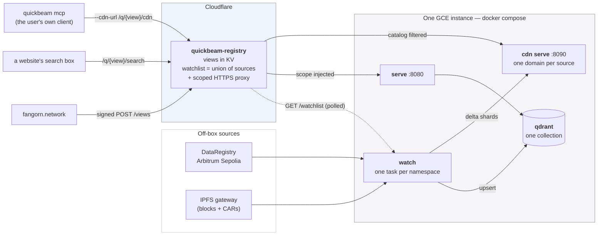
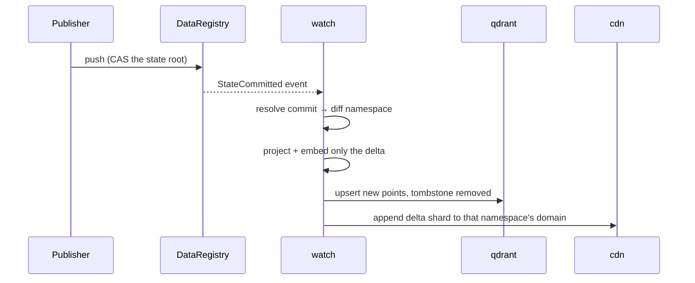

# Deploying Quickbeam

**One shared instance serves everyone, and each namespace is embedded exactly once.**
You stand it up once. After that, a user creates a *view* from the Fangorn website —
no SSH, no compose edit, no new container.

A **view** is a named set of namespaces belonging to one requester. It gets its own
search URL and its own MCP catalog, but it is a *filter* over the shared collection,
never a copy of the vectors. Two people asking for the same namespace get the same
points, and the second one costs no indexing work at all.

---

## Topology



**Embed once, view many.** The watchlist is the deduplicated union of every view's
sources, so a namespace is watched while at least one view references it and drops off
when the last one goes — no refcount needed.

**The per-view MCP is a filtered catalog.** `quickbeam mcp` is a pull-client whose
entire universe is whatever `/catalog` its `--cdn-url` returns, so the worker filtering
that catalog to a view's domains is what scopes it. By default the user runs the client
themselves; ticking "host an MCP for me" makes the worker create one **Cloud Run**
service per view instead — stateless, scale-to-zero, and nothing to do with this box.

**The worker proxies queries** because the instance speaks plain HTTP and a browser on
HTTPS cannot call it (mixed content). Proxying supplies TLS with no per-namespace DNS
record or certificate, and it injects the view's `scope` so a view URL always means
that view's namespaces.

**A source is the whole `app:publisher:subspace` triple.** The app is the first leg and
it is what every chain read resolves against, so each watched source carries its own —
one instance can serve views across several apps. `--app` is only the fallback for a
watch-list entry that names none; an entry with no app and no fallback is dropped rather
than guessed, because reading the wrong app silently indexes the wrong graph.

**Naming rule, shared by two codebases:** a source's CDN domain is
`{app[2:10]}-{owner[2:10]}-{namespace}` — `_domain_for()` in `quickbeam/watcher.py`
names the directory, `domainFor()` in the worker names it back to filter a catalog. All
three legs are needed: two publishers both calling a namespace `music` would intermix
their shards in one domain, and so would one publisher holding `music` in two apps. A
bare app *name* (only reachable from a hand-run static watcher) is slugged whole
instead of sliced.

### What happens when a commit lands



`quickbeam watch` is **push-based**. `--poll-interval` is the reconnect backoff for a
dropped stream, *not* a polling timer. `--sources-refresh` is the separate interval at
which it re-reads the watch list.

---

## 1. Run it locally

Prove the image before any cloud is involved. Local runs don't need the worker — point
`SOURCES_URL` at a file.

```sh
cd quickbeam
cp .env.example .env      # set ETH_PRIVATE_KEY, PINATA_GATEWAY, QDRANT_API_KEY, APP
./up.sh                   # = docker compose up -d --build, plus the GPU overlay if usable
```

`up.sh` is the entry point rather than `docker compose up` because the GPU overlay must
not be layered in blind — see **GPU** below. Plain `docker compose up -d --build` still
works and gives you the CPU image. Extra compose files pass straight through:
`./up.sh -f docker-compose.local.yml`.

`--build` is not optional the first time, and not optional after a source change either:
the Dockerfile `COPY`s `quickbeam/` at build time, so a plain `docker compose up -d`
silently reuses the old layer and reproduces bugs you already fixed. To rebuild without
starting anything, `docker compose build`.

For a static list, write `sources.json` into the shared volume and set
`SOURCES_URL=file:///data/sources.json`:

```json
[ {"app": "fangorn", "owner": "0x147c24c5Ea2f1EE1ac42AD16820De23bBba45Ef6",
   "namespace": "robinhood"} ]
```

The list also accepts `"APP:OWNER:NAMESPACE"` strings, the older `"OWNER:NAMESPACE"`
form (which takes `APP` as its app), and either form wrapped in `{"sources": …}` —
which is the shape the worker's `/watchlist` returns. `*` on any of owner/namespace is
a wildcard that widens the subscription to the app level.

Check it:

```sh
docker compose logs -f watch
#   [Watcher] + 0x7e14…:0x147c…:robinhood — now watching 1 source(s)
#   [Watcher] 0x147c…:robinhood: subscribed (pid …)
#   [Watcher] 0x147c…:robinhood: seeded — N new record(s) embedded

curl 'localhost:8080/search?q=<term>&scope=0x147c24c5…:robinhood'
curl localhost:8090/domains/7e1497af-147c24c5-robinhood/manifest  # {app8}-{owner8}-{ns}
```

**Add a second entry to the file and watch a second task start with no restart.** That
is the whole point of the design — if it needs a restart, something regressed.

A non-zero `N` in the seed line is the real proof: the Node CLI, the chain read, the
IPFS fetch, the projection and the embed all worked.

> **`seeded — no new records` / `head: null`?** That namespace has nothing settled
> on-chain. Confirm with
> `docker compose exec watch fangorn read <ns> --owner <owner>` — if it returns
> `"head":null` with empty arrays, nothing was ever pushed there. Not a deployment
> fault.

### Configuration

| Variable          | Notes                                                                                                                                                                                                                                                                                                                         |
| ----------------- | ----------------------------------------------------------------------------------------------------------------------------------------------------------------------------------------------------------------------------------------------------------------------------------------------------------------------------- |
| `SOURCES_URL`     | The registry worker's `/watchlist` — the deduplicated union of every view's sources. Namespaces arrive there, never here.                                                                                                                                                                                                     |
| `SOURCES_REFRESH` | Seconds between watch-list polls.                                                                                                                                                                                                                                                                                             |
| `APP`             | Fallback app for a watch-list entry that names none. Entries from the worker always carry their own, so this only covers a hand-written list — but keep it equal to the worker's `DEFAULT_APP`, since that is what the worker stamps on a view created without one. A wrong value reads an empty namespace with **no error**. |
| `ETH_PRIVATE_KEY` | **Required even though the container only reads** — the `fangorn` CLI refuses to start without one. A throwaway is correct: never spent, no funding, no registration.                                                                                                                                                         |
| `PINATA_GATEWAY`  | Reads resolve every block by CID through this. The default is `ipfs.io`, DNS-filtered on many networks.                                                                                                                                                                                                                       |
| `QDRANT_API_KEY`  | Any random string; Qdrant enforces it on every request.                                                                                                                                                                                                                                                                       |
| `COLLECTION`      | One collection for all namespaces.                                                                                                                                                                                                                                                                                            |
| `INTERVAL`        | Reconnect backoff. Not a monitoring interval.                                                                                                                                                                                                                                                                                 |

Do **not** bake a `~/.fangorn/config.json` into the image. The CLI returns early when
that file exists and ignores every environment variable above.

---

## 2. Build the image

All four Quickbeam services are the **same image** with different commands, so it builds
once and is tagged `${IMAGE}` (default `quickbeam:local`). The build installs the CPU
ONNX stack and the Node CLI and bakes the embedding model in (`Dockerfile` — left to run
time it re-downloads on every container start), so expect several minutes and a ~2.5GB
image (measured 2026-08-13).

```sh
docker compose build          # tags quickbeam:local
```

### GPU

`./up.sh` gives the `watch` service the GPU when — and only when — the host has a working
driver (`nvidia-smi -L`) **and** Docker has the nvidia container runtime registered. Both
halves matter: `gpus: all` on a box missing either one fails the container at start, so a
compose file that reserves a GPU unconditionally is a footgun. Without both it builds the
CPU image, which works, just slower. What you should see:

```sh
./up.sh
#   ==> GPU detected — building the CUDA image for `watch`
docker compose exec watch python -c "from fastembed import TextEmbedding as T; \
  print(T(model_name='nomic-ai/nomic-embed-text-v1.5').model.model.get_providers())"
#   ['CUDAExecutionProvider', 'CPUExecutionProvider']
```

`CPUExecutionProvider` alone in that list means the CUDA provider failed to `dlopen` and
onnxruntime fell back **silently** — no error, ~10x slower (147 docs/s vs 1433/s measured
on an RTX 2070). `docker compose logs watch | grep -i cuda` shows the loader error.

Only `watch` gets a device. `serve` and `mcp` embed one short query per request, where a
CPU session costs milliseconds and does not hold VRAM, so they stay on the CPU image —
which is also why the GPU build is tagged separately (`${IMAGE}-gpu`): the same tag must
never be built from two different `EXTRAS` values. The image is bigger by the CUDA 12
wheels (cuBLAS, cuRAND, cuFFT, nvrtc, cudart) that `onnxruntime-gpu` links but does not
bundle; only `libcuda.so.1` comes from the host, injected by the runtime.

The GCE deployment has no GPU and is unaffected — `deploy.sh` builds the default CPU
image, and `EXTRAS` defaults to `cpu`.

**Build here, not on the box.** E2 shared-core types are burstable and small; installing
the ONNX stack on one is slow at best and OOMs at worst, and it burns the same burst
credits the watcher needs to seed. Push a built image instead — which is also why the box
never needs the source.

### Push it to Artifact Registry

```sh
PROJECT=$(gcloud config get-value project)
REGION=us-east4
IMG=$REGION-docker.pkg.dev/$PROJECT/quickbeam/quickbeam:latest

# One-time, per project.
gcloud artifacts repositories create quickbeam \
  --repository-format=docker --location=$REGION
gcloud auth configure-docker $REGION-docker.pkg.dev

docker build -t $IMG . && docker push $IMG
```

`IMAGE` in `.env` is what points the compose stack at that tag; it defaults to a local
build, so leaving it unset keeps step 1 working unchanged.

`:latest` keeps the deploy a one-liner, at the cost of not being able to tell which build
a box is running — `docker compose pull` will not say whether the tag moved. If that
matters, tag `:$(git rev-parse --short HEAD)` as well and put that in the box's `.env`;
rollback is then the previous tag instead of a rebuild.

---

## 3. The instance

```sh
gcloud compute instances create quickbeam-1 \
  --machine-type=e2-medium \
  --boot-disk-size=20GB --boot-disk-type=pd-balanced \
  --zone=$REGION-a \
  --image-family=debian-12 --image-project=debian-cloud \
  --tags=quickbeam --scopes=cloud-platform
```

`--scopes=cloud-platform` is what lets the VM's default service account pull from
Artifact Registry; without it the pull 403s and nothing else on the box explains why.

Install Docker once:

```sh
gcloud compute ssh quickbeam-1 --zone=$REGION-a --command='
  sudo apt-get update && sudo apt-get install -y docker.io docker-compose-v2 &&
  sudo usermod -aG docker $USER &&
  gcloud auth configure-docker '$REGION'-docker.pkg.dev --quiet'
```

### Ship it

**The box never gets the source — only two files.** The image is already built, so a
clone there would be dead weight that also invites an accidental `--build` on a machine
that cannot afford one:

```sh
gcloud compute scp docker-compose.yml .env quickbeam-1:~/ --zone=$REGION-a
gcloud compute ssh quickbeam-1 --zone=$REGION-a --command='docker compose pull && docker compose up -d'
```

The `.env` you copy **must** contain `IMAGE=$IMG`. Without it the compose file falls back
to `quickbeam:local`, which does not exist on the box, and `docker compose up` tries to
build from a directory holding no Dockerfile. That is the one failure mode of this flow,
and its error message points at the build, not at the missing variable.

`docker compose ps` should then show `qdrant`, `watch`, `cdn`, `serve` and `mcp` up, with
`cdn` restarting until the watcher bakes the first domain (see the gotchas).

**Open the two ports to the worker:**

```sh
gcloud compute firewall-rules create quickbeam-http \
  --allow=tcp:8080,tcp:8090 --target-tags=quickbeam \
  --description="registry worker → search + cdn"
```

Cloudflare Workers egress from the public internet with no fixed range, so
`--source-ranges` cannot be narrowed to them; the instance is reachable by anyone who
finds the IP. Both ports are read-only query surfaces, and the money actions live behind
the worker's signature checks. Two ports stay closed on purpose: Qdrant's `6333` (bound
to loopback in `docker-compose.yml`, and holding write routes), and the `mcp` service's
`8765`, which serves the **whole** corpus unscoped — per-view MCP is the user's own
client against `/q/{viewId}/cdn`.

Then point the worker at the box and deploy it:

```sh
gcloud compute instances describe quickbeam-1 --zone=us-east4-a \
  --format='get(networkInterfaces[0].accessConfigs[0].natIP)'
# → set SEARCH_URL = http://<IP>:8080 and CDN_URL = http://<IP>:8090
#   in webworker/quickbeam-registry/wrangler.toml
cd ../webworker/quickbeam-registry && wrangler deploy
```

There is no `MCP_URL`: a user's MCP is their own `quickbeam mcp` client pointed at
`/q/{viewId}/cdn`.

**Survive a reboot.** Every service is `restart: unless-stopped`, so Docker brings the
stack back as long as the daemon starts: `sudo systemctl enable docker`. Nothing else is
needed — no unit file, no cron.

**Redeploying a code change** is the same three commands, and only `docker-compose.yml`
needs re-copying if it changed:

```sh
docker build -t $IMG . && docker push $IMG
gcloud compute scp docker-compose.yml quickbeam-1:~/ --zone=$REGION-a   # if it changed
gcloud compute ssh quickbeam-1 --zone=$REGION-a --command='docker compose pull && docker compose up -d'
```

Compose recreates only the services whose image actually changed, and the `qdrant` and
`data` volumes are untouched, so the collection and the baked shards survive.

**Machine type.** `e2-medium` (4GB) is the working default above. `e2-small` (2GB) runs
but leaves little headroom — if a seed OOMs there, stop the instance, change the type and
start it again; the disk survives, so it costs a minute. `e2-micro` (1GB, free tier) is
too small: the ONNX model plus one Node subscribe process per source will not fit.

**Do big backfills elsewhere.** E2 shared-core types are burstable (`e2-small`
baselines at 0.5 vCPU) and a full seed embed is a sustained burn that exhausts burst
credits. Build the collection on a GPU box and restore a snapshot here (see the
Snapshots section in `README.md`); the instance then only handles deltas.

**What scales per namespace** is one `fangorn subscribe` Node process, not the model.
Measure its RSS before promising a namespace count.

---

## 4. Adding and removing views

**Adding** is a user action: sign in at fangorn.network with an active storage
subscription, name a view and give it a publisher + namespace, and press Create. The
worker stores the view and its sources join the watchlist; this instance picks up any
*new* namespace within `SOURCES_REFRESH` and logs `[Watcher] + owner:namespace`.

A namespace another view already covers logs nothing at all — it is already embedded,
and the new view queries the same points. That silence is the design working.

**Removing** is a founder action — `POST /admin/remove` with the view id, signed by a
wallet in `ADMIN_WALLETS`. See `webworker/quickbeam-registry/README.md`. A source stops
being watched only when the **last** view referencing it goes; nothing expires on its
own, so a lapsed subscription keeps running until someone removes it.

Neither touches this box.

---

## Gotchas

- **The compose `mcp` service serves the whole corpus,** not a view — it is bound to
  one `--cdn-url` at startup. Per-view MCP is the user's own client pointed at
  `/q/{viewId}/cdn`. Its endpoint is `/mcp`, not `/`: a healthy server returns 404 on
  `/` and 400 on `/mcp` for a request without a handshake.
- **The CDN domain rule is duplicated in two languages.** `_domain_for()` in
  `watcher.py` and `domainFor()` in the registry worker must agree, or a view's catalog
  comes back empty. If you change one, change the other — `tests/test_watchlist.py`
  re-derives the worker's version from its actual source and fails if they drift.
- **The watch-list fetch sends an explicit `User-Agent`.** The worker sits behind
  Cloudflare, whose bot-signature check answers urllib's default `Python-urllib/x.y`
  with a **403 (error 1010)** before the worker ever runs. `/watchlist` is
  unauthenticated, so a 403 there means the edge blocked you, not that you lack access —
  and the watcher then holds its current set forever with zero sources, which cascades
  into `cdn` restart-looping because no domain is ever baked.
- **Points embedded before the app dimension have no `meta.app`.** They will not match
  an app-scoped filter or bake into a three-part domain. A collection from an older
  build needs a re-embed (drop it and let the seed rerun), not a migration.
- **`cdn` restart-loops for a few seconds on first boot** — `cdn serve` exits if its
  directory does not exist yet, and the watcher creates it when it bakes the first
  domain. The restart policy covers the window.
- **A registry blip does not tear down the fleet.** If the watch-list fetch fails, the
  watcher keeps every running source rather than reading the failure as
  "everyone unsubscribed".
- **`Api key is used with an insecure connection`** is expected inside the compose
  network. It matters only if you expose Qdrant publicly.
- **The subscribe cursor lives at `/data/.fangorn/`** — that is why the working
  directory is the mounted volume; an ephemeral one replays from scratch on restart.
- **The embedding model is baked into the image.** Changing `--embedding-model` means
  rebuilding, or it downloads at every container start.
- **CPU-only hosts work** because `_build_text_embedding()` asks onnxruntime which
  providers exist before requesting CUDA. A GPU box still selects CUDA automatically —
  but only if the image was built with `EXTRAS=gpu`, which is `up.sh`'s job. The CPU
  image has no CUDA provider to find, so a GPU host running it is silently CPU-bound.
- **`/browse` is not namespace-scoped.** It returns the whole collection. The search
  routes are the scoped ones.

## Teardown

```sh
docker compose down -v     # -v also drops the Qdrant data and every CDN shard
```
